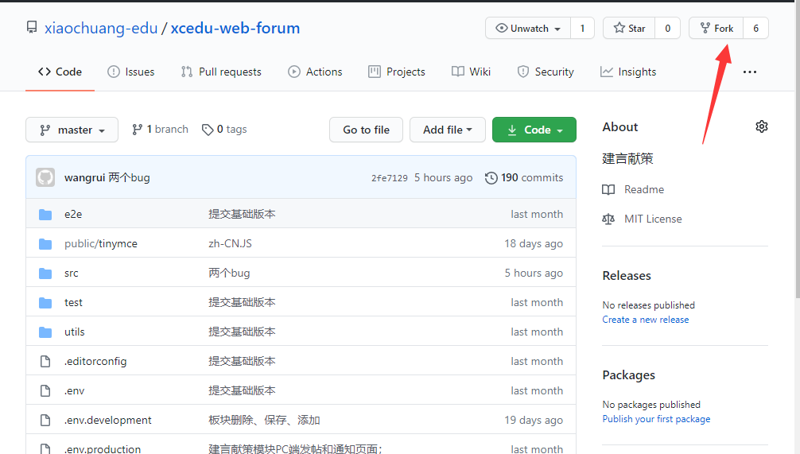
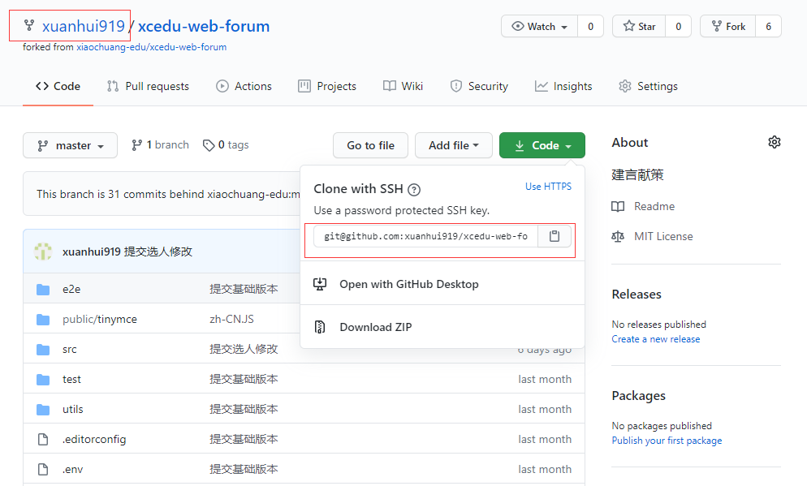
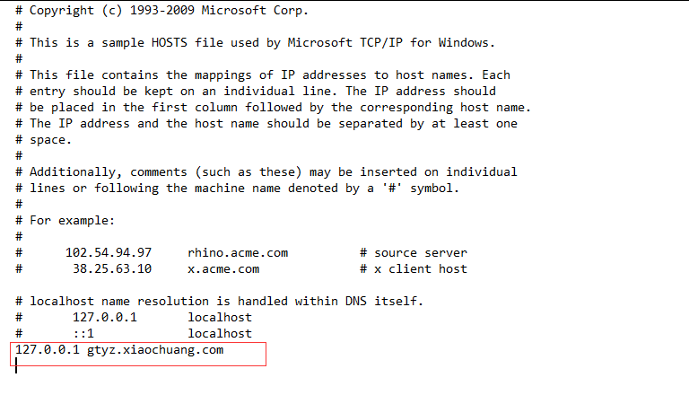
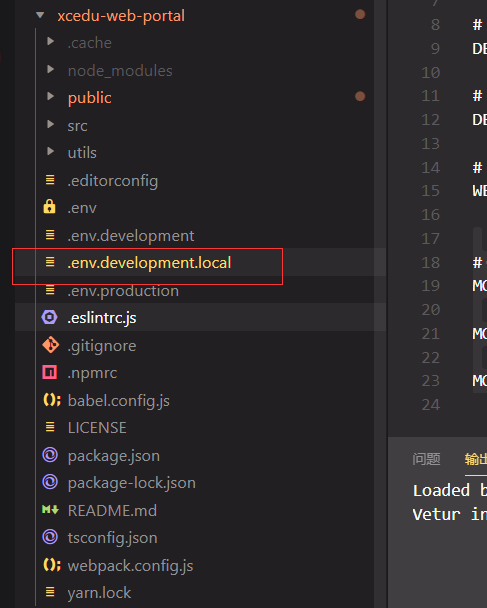
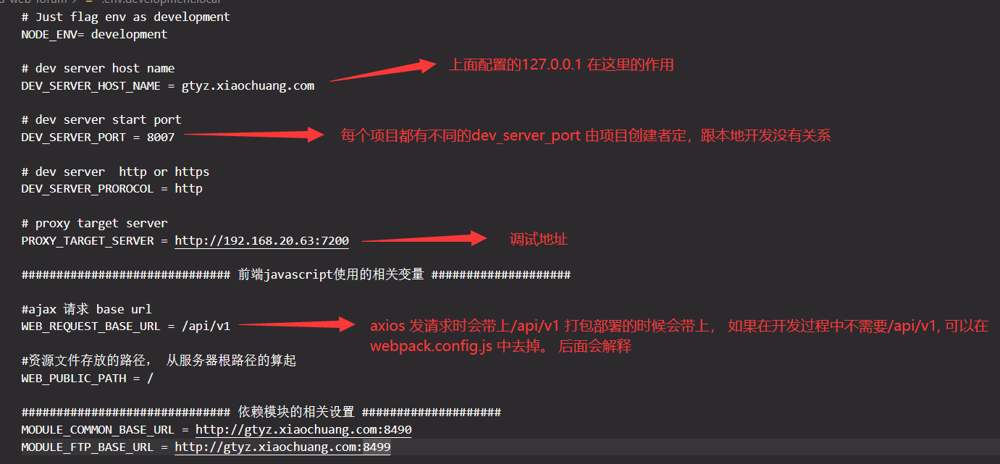
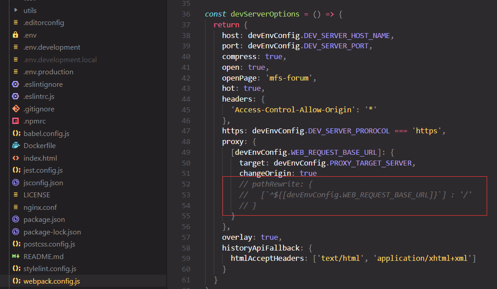

## 安装开发工具
* <a href="https://npm.taobao.org/mirrors/node/v10.16.2/" target="_blank">nodejs(v10.16.2) </a> <span style="color: red">高版本会导致不兼容</span>

* <a href="https://yarn.bootcss.com/" target="_blank">yarn </a> 
 
### 项目地址 
本地开发公用模块 [git@github.com:xiaochuang-edu/xcedu-web-common.git](https://github.com/xiaochuang-edu/xcedu-web-common) 
 
本地开发首页模块 [git@github.com:xiaochuang-edu/xcedu-web-portal.git](https://github.com/xiaochuang-edu/xcedu-web-portal)

公用组件模块 [git@github.com:xiaochuang-edu/xcdeu-web-components.git](https://github.com/xiaochuang-edu/xcdeu-web-components)

校本题库 [git@github.com:xiaochuang-edu/xcedu-web-testBank.git](https://github.com/xiaochuang-edu/xcedu-web-testBank)

建言献策 [git@github.com:xiaochuang-edu/xcedu-web-forum.git](https://github.com/xiaochuang-edu/xcedu-web-forum)

### 项目拷贝
进入模块地址 fork master项目地址到你的profile中, 复制地址

执行shell 例如 "git clone git@github.com:xuanhui919/xcedu-web-forum.git"

 

 


### yarn 安装

在本地项目中安装依赖，推荐使用 yarn 的方式安装，它能更好地和 [webpack](https://webpack.js.org/) 打包工具配合使用。

```shell
cd xcedu-web-forum
yarn install 
```
<span style="color: red">如果遇到yarn.lock报错信息，在本地项目中删除yarn-lock.json 文件， 再次执行 yarn install </span>

### 系统设置localhost

进入c/Windows/System32/drivers/etc 找到hosts 文件复制出来编辑

在最后的位置，添加配置项 <span style="color: red">127.0.0.1 gtyz.xiaochuang.com(gtyz.xiaochuang.com)是在项目中的webpack.config.js 中预设的。如果你需要改成别的名字，则全部需要改掉， 你也可以不配置，那么在项目的配置文件中， 需要把所有 gtyz.xiaochuang.com 的地方改成 127.0.0.1 或者 你的ip地址</span> 

 

### 启动项目
本地启动项目时需要同时启动 common 和 你要开发的模块。 common 包含了开发需要的公用样式文件，公用组件（选人， 附件 等）。
:::tip
如果需要在本地调试ie兼容问题，需要再同时启动 portal 模块。(本地单独启动开发模块时，ie不支持某些操作，导致报错)
:::

### 本地开发注意事项
* 本地开发 需要调试各自的接口 ， 在项目根目录下 复制文件.env.development， 重命名为.env.development.local 该文件在提交时不会被提交， 只在开发模式下有效 。

  

* 项目中的.env.develop.local 注解

  

* 项目中的 webpack.config.js 注解
 

 ```json
    pathRewrite: {
        [`^${[devEnvConfig.WEB_REQUEST_BASE_URL]}`] : '/' 
    }
 ``` 

:::tip
暂时需要解释的只有pathRewrite, 这个属性是在axios 发送请求时重定向。 这里写的意思是，把/api/v1 换成/

例如 发送请求的地址是 http://192.168.20.63:7200/api/v1/api-personalized/advise/user/setting/getUserSetting 在本地请求时会变成 http://192.168.20.63:7200/api-personalized/advise/user/setting/getUserSetting 
:::